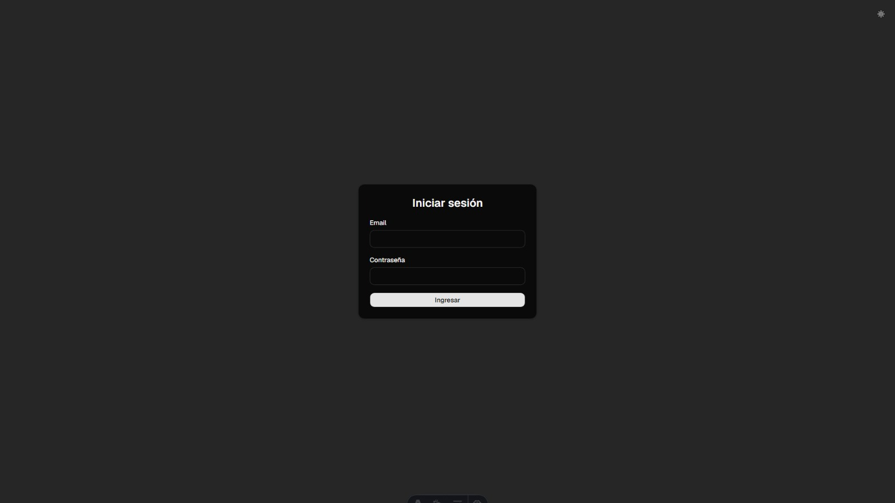
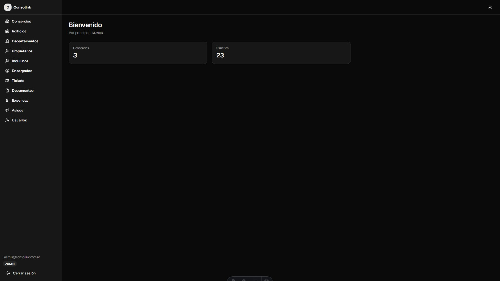
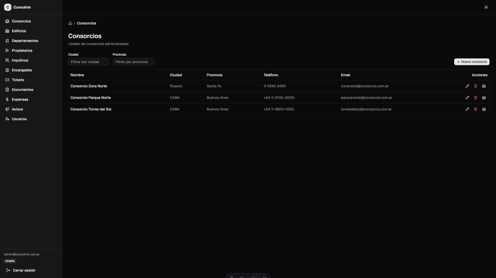
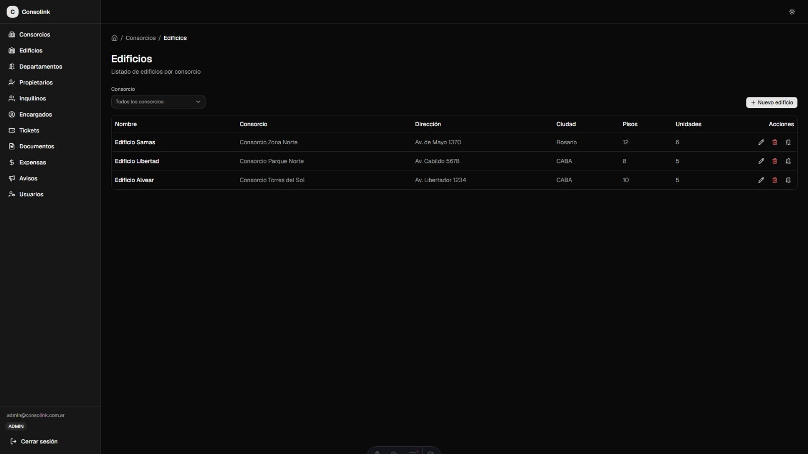
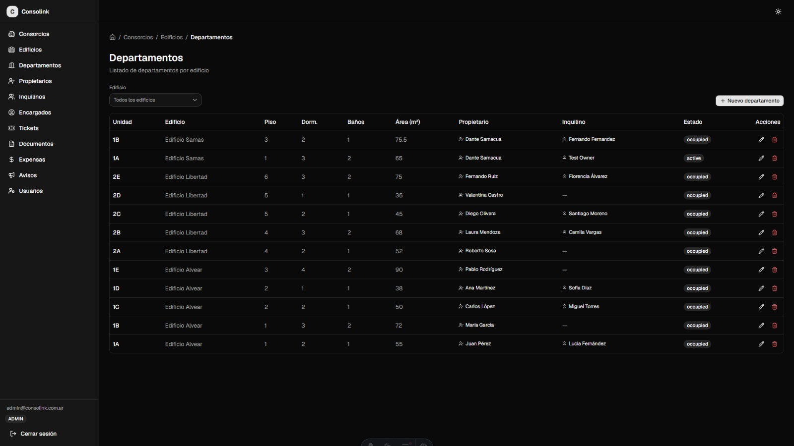
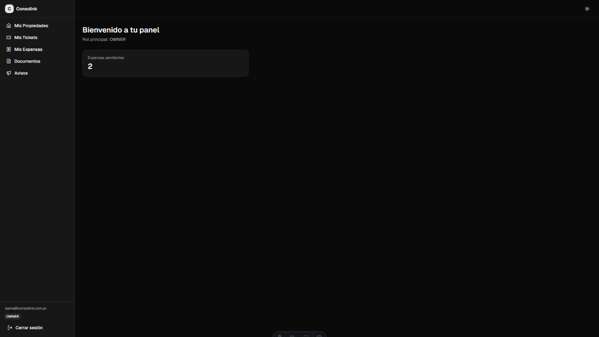
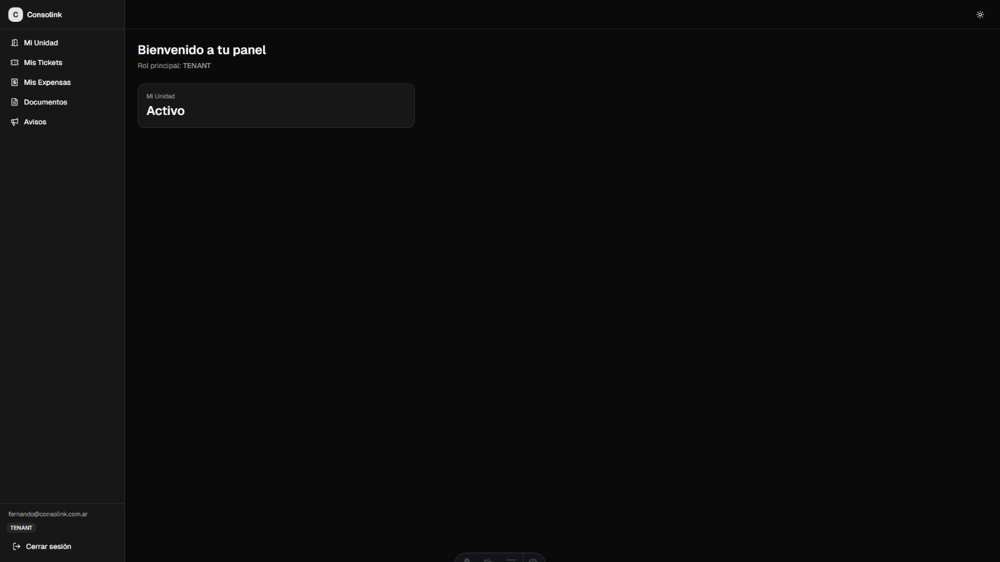
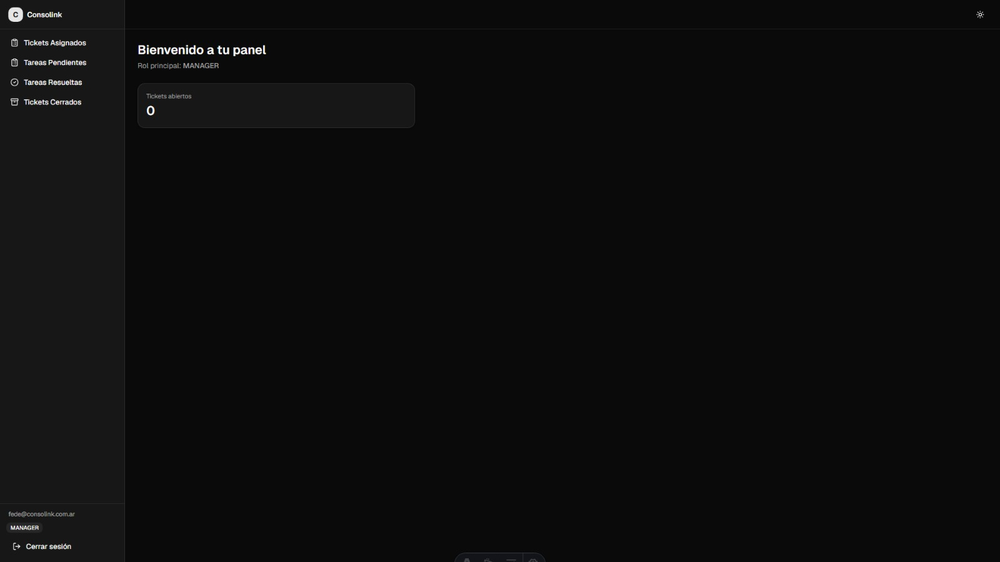
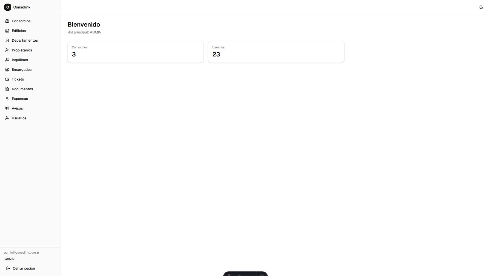

# ConsoLink — Sistema de Gestión de Consorcios

Plataforma centralizada para administrar consorcios, edificios, departamentos, propietarios, inquilinos, encargados, expensas, tickets de reparaciones, avisos, documentos y calendario de eventos, con roles y permisos diferenciados.

> **⚠️ IMPORTANTE: Este repositorio contiene ÚNICAMENTE el frontend.**
>
> El backend (API REST en Node.js + Express + PostgreSQL + Prisma ORM) fue desarrollado en paralelo pero **no está incluido ni publicado** en este repositorio.
>
> Por lo tanto, **este proyecto no es funcional ni ejecutable de forma standalone** clonando este repositorio — no hay una API real corriendo detrás. Es un proyecto de **práctica y aprendizaje personal**, creado para ejercitar el desarrollo full-stack en un escenario con múltiples roles, autenticación, autorización y una base de datos relacional con relaciones complejas. No es un producto en producción ni está pensado para uso real.

---

## Demo visual

_(Las capturas se agregarán a medida que se tomen. Los nombres de archivo sugeridos están listos en `docs/screenshots/`.)_

### Login

| Vista previa |
|--------------|
|  |

### Dashboard ADMIN

| Vista previa |
|--------------|
|  |

### Gestión — Consorcios, Edificios y Departamentos

| Consorcios | Edificios | Departamentos |
|------------|-----------|---------------|
|  |  |  |

### Dashboard OWNER

| Vista previa |
|--------------|
|  |

### Dashboard TENANT

| Vista previa |
|--------------|
|  |

### Dashboard MANAGER

| Vista previa |
|--------------|
|  |

### Tema claro / oscuro

| Claro | Oscuro |
|-------|--------|
|  |  |

---

## Stack tecnológico

### Frontend (este repositorio)

| Tecnología | Uso |
|------------|-----|
| [Astro](https://astro.build) (SSR — `output: 'server'`) | Framework principal, renderizado del lado del servidor con islas de interactividad |
| [React 19](https://react.dev) | Islas interactivas (formularios, tablas, paneles) |
| [TypeScript](https://www.typescriptlang.org) | Tipado estático en todo el código |
| [Tailwind CSS v4](https://tailwindcss.com) | Estilos utilitarios |
| [shadcn/ui](https://ui.shadcn.com) (estilo `radix-nova`) | Componentes de UI base (botones, modales, selects, tablas, etc.) |
| [Radix UI](https://www.radix-ui.com) | Primitivas de accesibilidad para los componentes |
| [React Hook Form](https://react-hook-form.com) + [Zod](https://zod.dev) | Manejo de formularios y validación |
| [TanStack React Query](https://tanstack.com/query/latest) | Data fetching y caché del lado del cliente |
| [Zustand](https://github.com/pmndrs/zustand) | Estado global de UI (tema, sidebar, etc.) |
| [Lucide React](https://lucide.dev) | Iconografía |

### Backend (no incluido en este repositorio)

| Tecnología | Uso |
|------------|-----|
| Node.js + Express | Servidor HTTP y enrutamiento |
| PostgreSQL | Base de datos relacional |
| Prisma ORM | Modelado y acceso a datos (con `@prisma/adapter-pg`) |
| Zod | Validación de esquemas en el servidor |
| JWT (jsonwebtoken) | Autenticación via cookie httpOnly |
| Multer | Subida de archivos (documentos adjuntos) |

---

## Funcionalidades implementadas

### ADMIN

- CRUD completo de consorcios, edificios, departamentos, propietarios, inquilinos y encargados
- CRUD de usuarios del sistema y asignación de roles (many-to-many)
- Gestión de expensas: generación masiva por consorcio, marcado como pagado/pendiente
- Gestión de tickets: listar todos, asignar a un encargado, cambiar estado
- Avisos: creación, edición y eliminación (con targeting por consorcio/edificio)
- Calendario: eventos del consorcio (crear, editar, eliminar)
- Documentos: visualización de todos los documentos del sistema
- Tareas: panel de tareas pendientes y resueltas
- Dashboard con estadísticas (cantidad de consorcios, usuarios)

### OWNER

- **Mis Propiedades**: lista de sus departamentos con datos del edificio, inquilino actual y estado
- **Mis Tickets**: crear tickets de reparación, listar los propios, ver detalle y comentarios
- **Mis Expensas**: consultar expensas de sus unidades, ver estado de pago
- **Documentos**: ver documentos asociados a sus propiedades
- **Avisos**: leer avisos publicados por la administración

### TENANT

- **Mi Unidad**: ver datos del departamento asignado, información del edificio y del consorcio
- **Contrato**: estado del contrato (vigente, por vencer, vencido) con cuenta regresiva de días restantes
- **Mis Tickets**: crear tickets, listar los propios, ver detalle y comentarios
- **Mis Expensas**: consultar expensas de su unidad
- **Documentos**: ver documentos asociados a su unidad (reglamentos, recibos, etc.)
- **Avisos**: leer avisos publicados

### MANAGER

- **Tickets Asignados**: listar tickets asignados, cambiar estado (en progreso, resuelto, cerrado)
- **Tickets Cerrados**: historial de tickets resueltos/cerrados
- **Tareas Pendientes / Resueltas**: panel de tareas

---

## Arquitectura y decisiones técnicas

- **SSR con Astro + islas de React**: las páginas se renderizan en el servidor; solo los componentes interactivos (formularios, tablas con filtros) son islas `client:load`. Cada página define su propia isla raíz `*PageRoot.tsx` que envuelve al `QueryProvider`, evitando el error de múltiples providers por página.
- **Autenticación via cookie httpOnly (`auth_token`)**: el token JWT nunca es accesible desde JavaScript del lado del cliente. El middleware de Astro lee la cookie y la reenvía al backend (`GET /api/auth/me`) para obtener el usuario autenticado. El frontend nunca almacena ni envía el token manualmente.
- **Roles many-to-many con `UserRole`**: los usuarios pueden tener múltiples roles simultáneamente (ej. ADMIN + OWNER). La navegación del sidebar se construye combinando todos los roles del usuario, sin `if/else if` excluyentes.
- **Patrón de aislamiento por página (QueryProvider)**: cada isla raíz de página contiene su propio `QueryProvider`. No hay un provider global que intente abarcar múltiples islas en una misma página, respetando la independencia de cada raíz React en Astro.
- **Formularios con React Hook Form + Zod**: todos los formularios siguen el mismo patrón: schema Zod validado con `@hookform/resolvers`, errores de servidor mapeados a campos específicos, y manejo de estados de carga/envío/error.

Para una descripción más detallada de la arquitectura, ver [`docs/ARQUITECTURA.md`](./docs/ARQUITECTURA.md) y [`docs/DECISIONES.md`](./docs/DECISIONES.md).

---

## Aprendizajes y desafíos del proyecto

Este proyecto presentó desafíos reales propios de una aplicación full-stack con múltiples roles:

- **SSR + islas de React en Astro**: coordinar el fetching de datos del lado servidor (middleware de autenticación, dashboard stats) con la carga asíncrona de datos del lado cliente (TanStack Query dentro de las islas).
- **Sincronización de roles many-to-many con tablas de perfil**: mantener consistencia entre la tabla `UserRole` y las tablas de perfil (`Owner`, `Tenant`, `Manager`) al crear usuarios con un rol específico, sin hardcodear relaciones ni asumir un único rol.
- **Autenticación con cookie httpOnly y SSR**: el middleware de Astro debe leer la cookie, consultar el backend y adjuntar el usuario a `Astro.locals` — todo antes de renderizar la página. Esto requiere manejar tokens expirados, redirecciones y errores de red sin perder la experiencia de navegación.
- **Sistema de permisos por rol**: diseñar rutas protegidas con `requireRole()` que verifican pertenencia a un conjunto de roles, no a uno fijo. La navegación del sidebar también debía respetar esta lógica sin duplicar items para usuarios con múltiples roles.
- **Formularios responsivos con dependencias entre selects**: por ejemplo, seleccionar un consorcio → filtrar edificios → filtrar departamentos, todo dentro de diálogos modales (shadcn Dialog + Radix Select), con cuidado de no cerrar el modal al elegir una opción.

---

## Documentación interna

Para quien quiera profundizar en el diseño técnico completo:

- [`docs/ERD.md`](./docs/ERD.md) — Modelo entidad-relación y esquema de base de datos
- [`docs/ARQUITECTURA.md`](./docs/ARQUITECTURA.md) — Arquitectura general y flujo de autenticación
- [`docs/API.md`](./docs/API.md) — Endpoints REST del backend (referencia)
- [`docs/DECISIONES.md`](./docs/DECISIONES.md) — Decisiones de diseño fundamentadas

---

## Autor

Proyecto personal de práctica y aprendizaje.  
_(Completar con nombre / contacto / LinkedIn)_
