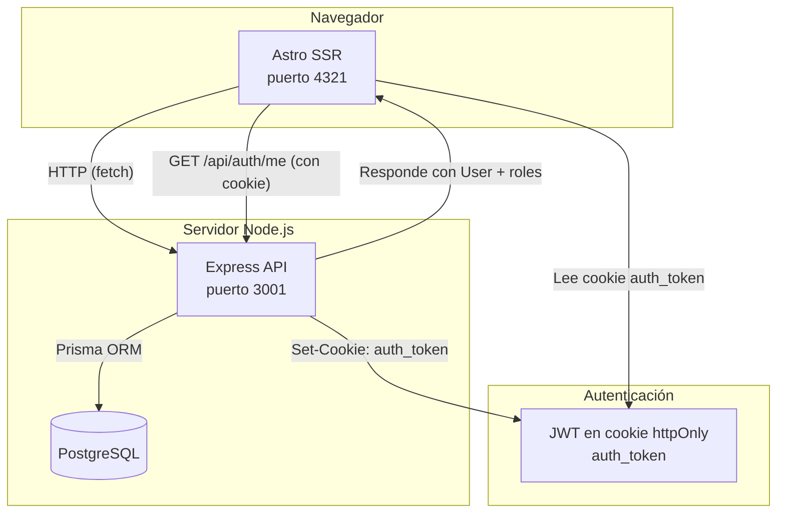

# Arquitectura — Consolink

## Diagrama de alto nivel

## Flujo de autenticación

1. El frontend (Astro SSR) envía credenciales a `POST /api/auth/login`.
2. El backend valida, genera un JWT (HS256, expira en 24 h) y lo devuelve como cookie `httpOnly` (`Set-Cookie: auth_token=<jwt>`).
3. En cada request siguiente, el middleware de Astro (`src/middleware.ts`) lee la cookie `auth_token` y la reenvía al backend (`GET /api/auth/me`) para obtener el usuario y sus roles.
4. El resultado se almacena en `context.locals.user` y queda disponible para páginas e islas de React.
5. En el backend, el middleware `authenticate` verifica el JWT (de cookie o header `Authorization: Bearer`) y el middleware `authorize` controla el acceso por roles.

## Por qué carpetas separadas (backend/ y frontend/)

| Motivo | Detalle |
|--------|---------|
| **Independencia de despliegue** | Backend y frontend pueden escalarse por separado. Cada uno tiene su propio `package.json`, dependencias y configuración de TypeScript. |
| **Separación de responsabilidades** | El backend expone una API REST. El frontend es una SPA/SSR que consume esa API. No comparten código. |
| **Equipos paralelos** | Dos desarrolladores pueden trabajar simultáneamente en backend y frontend sin conflictos de merge. |
| **Stack diferente** | Backend: Express + Prisma + Zod. Frontend: Astro + React + Tailwind. No tiene sentido mezclar dependencias. |

## Stack técnico

### Backend (`backend/`)
- **Runtime:** Node.js + TypeScript 6.x
- **Framework:** Express 5.x
- **ORM:** Prisma 7.x con adaptador PostgreSQL (`@prisma/adapter-pg`)
- **Validación:** Zod 4.x
- **Autenticación:** JWT (HS256) + bcrypt
- **Middleware:** helmet, cors, morgan, cookie-parser, express-rate-limit, multer

### Frontend (`backend/consolink/`)
- **Runtime:** Node.js + TypeScript
- **Framework:** Astro 7.x con `output: 'server'` (SSR)
- **Adaptador:** `@astrojs/node` modo standalone
- **Islas interactivas:** React 19
- **Data fetching:** TanStack React Query
- **Estado global:** Zustand
- **Formularios:** React Hook Form + Zod
- **UI:** shadcn/ui (radix-nova) + Tailwind CSS v4 + Radix UI + Lucide icons
